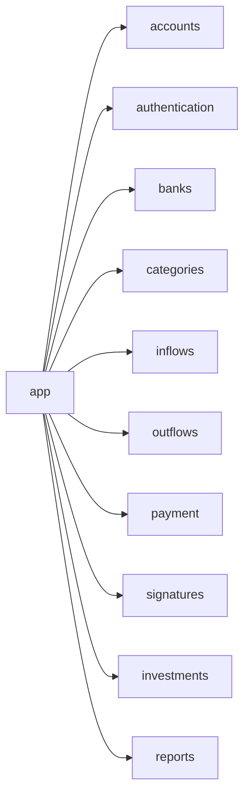

# Apps

## Estrutura de Apps

## app

Configuracoes globais do projeto.

| Arquivo | Funcao |
|---|---|
| `settings.py` | Settings com django-environ |
| `urls.py` | URLconf raiz |
| `views.py` | Dashboard + healthcheck + AJAX expenses |
| `celery.py` | Celery app instance |
| `tasks.py` | Tasks compartilhadas |
| `metrics.py` | Funcoes de metricas financeiras |
| `mixins.py` | Mixins reutilizaveis (UserScoped) |
| `context_processors.py` | total_balance context processor |
| `management/commands/wait_for_db.py` | Aguarda DB com retry |
| `management/commands/migrate_safe.py` | Migrations com advisory lock |
| `management/commands/load_fake_data.py` | Carga de dados de demonstracao |

## accounts

Cadastro e edicao de contas de usuario.

- **Modelo**: `Account` (OneToOne com User, campo `name`)
- **Signal**: `post_save` em User cria Account automaticamente
- **Views**: `AccountListView` (CBV), `account_create` e `account_edit` (FBVs)

## authentication

Endpoints JWT usando SimpleJWT.

| Rota | View |
|---|---|
| `api/v1/authentication/token/` | TokenObtainPairView |
| `api/v1/authentication/token/refresh/` | TokenRefreshView |
| `api/v1/authentication/token/verify/` | TokenVerifyView |

## banks

Cadastro de bancos com tipo de conta, agencia, conta e saldo.

- **Modelo**: `Bank` (user FK, name, account_type, agency, account, initial_balance, balance)
- **Views**: 5 CBVs CRUD + 2 DRF generics
- **Forms**: `BankForm` (remove initial_balance na edicao)

## categories

Categorias para organizacao de despesas.

- **Modelo**: `Category` (user FK, name, description)
- **Views**: 5 CBVs CRUD + 2 DRF generics

## inflows

Entradas de dinheiro vinculadas a bancos.

- **Modelo**: `Inflow` (user FK, bank FK, title, value)
- **Signals**: `pre_save` (guarda valor original), `post_save` (atualiza Bank.balance)
- **Views**: 3 CBVs + 2 DRF generics

## outflows

Saidas de dinheiro vinculadas a bancos e categorias.

- **Modelo**: `Outflow` (user FK, bank FK, category FK, title, value)
- **Signals**: `pre_save` (valida saldo), `post_save` (subtrai de Bank.balance)
- **Views**: 3 CBVs + 2 DRF generics

## payment

Cartoes de credito e compras parceladas.

- **Modelos**: `CreditCard` (user, bank, name, credit_limit, active), `Payment` (card, name, value, parcelas, paid)
- **Views**: 10 CBVs + 2 DRF generics + 2 mark-paid/unpaid Views
- **Logica**: `PaymentCreateView` divide compras parceladas com `bulk_create`

## signatures

Assinaturas recorrentes mensais.

- **Modelo**: `Signature` (user, bank, category, name, value, billing_day, is_active)
- **Service**: `generate_signature_outflows()` - geracao mensal de cobrancas
- **Views**: 5 CBVs + 1 cancel View + 2 DRF generics

## investments

Ativos de investimento e movimentacoes.

- **Modelos**: `InvestmentAsset` (user, bank, name, asset_type, current_value), `InvestmentMovement` (asset, operation_type, value)
- **Service**: `register_investment_movement()` - aporte/resgate atomico
- **Views**: 5 CBVs + 1 movement FormView + 4 DRF generics

## reports

Relatorios financeiros em PDF usando ReportLab.

| Rota | View | Relatorio |
|---|---|---|
| `reports/` | `ReportListView` | Pagina de listagem |
| `reports/custom/` | `CustomReportView` | Relatorio Personalizado (PDF) |

- **Modelo**: `GeneratedReport` (rastreia relatorios gerados)
- **Services**: `generate_custom_report()` (blocos: summary, inflows, outflows, by_category, investments)
