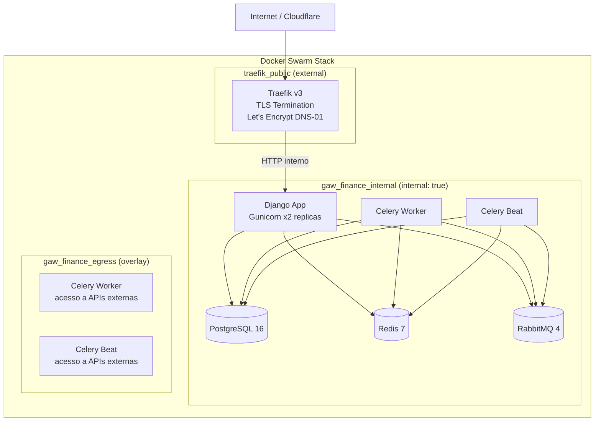
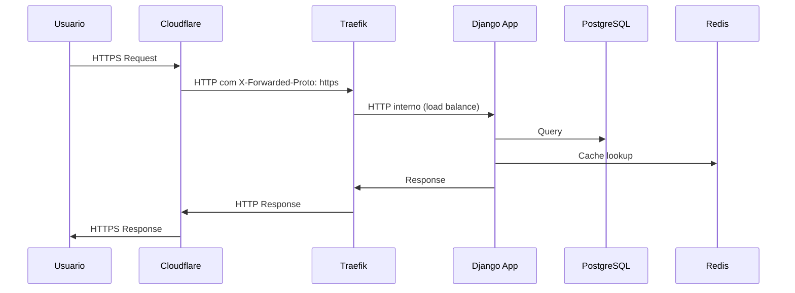
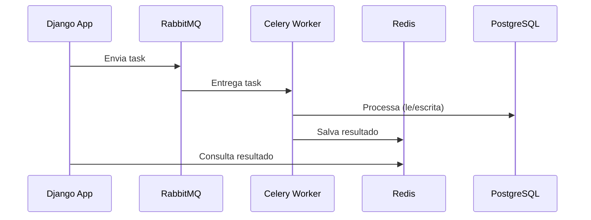

# Arquitetura

## Diagrama de Arquitetura

## Topologia de Redes

O stack usa tres redes overlay com isolamento granular:

| Rede | Tipo | Servicos | Proposito |
|---|---|---|---|
| `traefik_public` | external | traefik, app | Trafego HTTP externo |
| `gaw_finance_internal` | internal: true | app, db, redis, rabbitmq, celery_worker, celery_beat | Comunicacao entre servicos backend, sem acesso a internet |
| `gaw_finance_egress` | overlay (sem internal) | celery_worker, celery_beat | Acesso a internet para APIs externas, sem exposicao HTTP |

## Fluxo de Uma Requisicao

## Celery Task Flow

## Volumes e Persistencia

| Volume | Conteudo |
|---|---|
| `postgres_data` | Dados do PostgreSQL |
| `redis_data` | Persistencia do Redis |
| `rabbitmq_data` | Filas e mensagens do RabbitMQ |
| `media_data` | Arquivos de media do Django |
| `static_data` | Arquivos estaticos coletados |
| `letsencrypt_data` | Certificados TLS do Let's Encrypt |

## Docker Secrets

| Secret | Uso |
|---|---|
| `gaw_secret_key` | Django SECRET_KEY |
| `gaw_db_password` | Senha do PostgreSQL |
| `CLOUDFLARE_DNS_API_TOKEN` | Token da API do Cloudflare para DNS-01 challenge |
