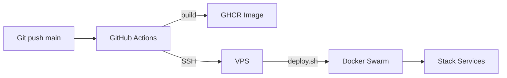

# Deploy

## Visao Geral

O deploy e feito com **Docker Swarm** na VPS, com **Traefik** como reverse proxy e **Let's Encrypt** para TLS.



## Pre-requisitos na VPS

### 1. Docker Swarm

```bash
docker swarm init
```

### 2. Rede Overlay Publica

```bash
docker network create --driver overlay traefik_public
```

### 3. Docker Secrets

```bash
echo -n 'sua-django-secret-key' | docker secret create gaw_secret_key -
echo -n 'senha-postgres-forte' | docker secret create gaw_db_password -
echo -n 'token-cloudflare-api' | docker secret create CLOUDFLARE_DNS_API_TOKEN -
```

### 4. Arquivo .env.prod

Crie `.env.prod` na raiz do projeto (veja `.env.example` para o template):

```env
DJANGO_ENV=prd
DEBUG=False
ALLOWED_HOSTS=seudominio.com,.seudominio.com,localhost,127.0.0.1
CSRF_TRUSTED_ORIGINS=https://seudominio.com,https://*.seudominio.com
POSTGRES_DB=gaw_db
POSTGRES_USER=gaw_db_user
DOMAIN=seudominio.com
ACME_EMAIL=seu-email@exemplo.com
GHCR_USER=guilhermeAndrade07
GHCR_TOKEN=seu-github-pat
```

## Deploy

### Deploy completo (build + push + stack deploy)

```bash
bash scripts/deploy.sh
```

### Redeploy sem rebuild (apenas configuracao)

```bash
bash scripts/deploy.sh --skip-build
```

## Servicos do Stack

| Servico | Replicas | Redes | Funcao |
|---|---|---|---|
| `app` | 2 | traefik_public, internal | Django + Gunicorn |
| `db` | 1 | internal | PostgreSQL 16 |
| `redis` | 1 | internal | Cache + Celery result backend |
| `rabbitmq` | 1 | internal | Celery broker |
| `celery_worker` | 1 | internal, egress | Processamento de tasks |
| `celery_beat` | 1 | internal, egress | Scheduler de tasks periodicas |
| `traefik` | 1 | traefik_public | Reverse proxy + TLS |

## Healthchecks

| Servico | Check |
|---|---|
| app | HTTP GET `/health/` |
| db | `pg_isready` |
| redis | `redis-cli ping` |
| rabbitmq | `rabbitmq-diagnostics check_port_connectivity` |
| traefik | `traefik healthcheck --ping` |

## Migrations

As migrations rodam no entrypoint do app com `pg_advisory_lock` para garantir que apenas uma replica migra por vez:

```
wait_for_db -> migrate_safe (advisory lock) -> collectstatic --clear -> gunicorn
```

## Backup

```bash
bash scripts/backup.sh
```

Salva em `backups/` com rotacao automatica (7 dias por padrao). Para alterar:

```bash
RETENTION_DAYS=30 bash scripts/backup.sh
```

## CI/CD

O workflow do GitHub Actions (`.github/workflows/deploy.yml`) executa em push para `main`:

1. **Lint & Test** - flake8 + testes Django
2. **Build & Push** - constroi imagem Docker e publica no GHCR
3. **Deploy** - SSH para VPS e executa `scripts/deploy.sh --skip-build`

### Secrets do GitHub

| Secret | Valor |
|---|---|
| `SSH_HOST` | IP da VPS |
| `SSH_USER` | Usuario SSH |
| `SSH_PRIVATE_KEY` | Chave privada SSH |

## Cloudflare

O certificado wildcard TLS e emitido via challenge DNS-01 com a API do Cloudflare.

### Criar o token

1. Acesse Cloudflare Dashboard > My Profile > API Tokens
2. Create Token > Custom
3. Permissions: **Zone > DNS > Edit**
4. Zone Resources: **Include > Specific Zone > seudominio.com**
5. Copie o token e crie o Docker Secret:

```bash
echo -n 'seu-token' | docker secret create CLOUDFLARE_DNS_API_TOKEN -
```
