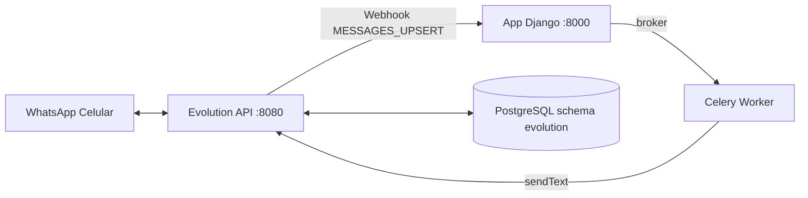

# Integracao WhatsApp (Evolution API)

Guia operacional da integracao com a Evolution API: como subir o projeto sem quebrar a conexao, como diagnosticar falhas de envio/recebimento e como reconectar a sessao.

## Visao Geral da Arquitetura



- A instância ativa chama-se `gaw-finance` (`EVOLUTION_INSTANCE_NAME` no `.env`).
- O webhook aponta para `http://app:8000/api/v1/whatsapp/webhook/` (nome do servico na rede interna do compose, nao use `localhost`).
- As mensagens de saida passam por `integrations.send_whatsapp_reply` (Celery) e as de entrada por `integrations.views.whatsapp_webhook`.

## Passo a Passo para Subir o Projeto no Docker

### 1. Subir os contêineres

O codigo **nao e montado via volume**: ele e copiado para a imagem no build. Sempre use:

```powershell
docker compose up -d --build
```

Sem `--build`, edicoes no codigo nao entram em vigencia (esse foi o motivo de o fix do webhook nao rodar na primeira tentativa).

### 2. Verificar o estado da conexao

No PowerShell use `curl.exe` (com extensao), pois `curl` e alias do `Invoke-WebRequest` e nao aceita `-H`:

```powershell
curl.exe -H "apikey: gaw-evolution-key" http://localhost:8080/instance/connectionState/gaw-finance
```

Resposta esperada:

```json
{"instance":{"instanceName":"gaw-finance","state":"open"}}
```

| Estado | Acao |
|---|---|
| `open` | Sessao conectada, seguir o fluxo |
| `close`/`connecting` | Reconectar (passo 3) |

### 3. Reconectar a sessao

```powershell
curl.exe -H "apikey: gaw-evolution-key" -X POST http://localhost:8080/instance/connect/gaw-finance
```

- Se retornar `{"instance":{"state":"open"}}`, reconectou sem QR novo.
- Se retornar um QR code (`base64`), escaneie com o celular: **WhatsApp > Configuracoes > Aparelhos conectados > Conectar um aparelho**.

Se o reconnect persistir com estado ruim ou as mensagens novas pararem de chegar (ver secao "Sessao Podre" abaixo), faca logout e gere QR novo:

```powershell
curl.exe -X DELETE -H "apikey: gaw-evolution-key" http://localhost:8080/instance/logout/gaw-finance
Start-Sleep -Seconds 5
curl.exe -H "apikey: gaw-evolution-key" http://localhost:8080/instance/connect/gaw-finance
```

### 4. Verificar o webhook

```powershell
curl.exe -H "apikey: gaw-evolution-key" http://localhost:8080/webhook/find/gaw-finance
```

O `url` deve apontar para `http://app:8000/api/v1/whatsapp/webhook/` e `enabled` deve ser `true`. O secret da URL precisa ser igual ao `WHATSAPP_WEBHOOK_SECRET` do `.env`.

### 5. Rodar as migrations (se precisar manualmente)

```powershell
docker compose exec app python manage.py migrate
```

No deploy de producao as migrations rodam no entrypoint com `pg_advisory_lock` (ver deploy.md).

### 6. Testar de ponta a ponta

Envie um registro pelo WhatsApp (conversa com voce mesmo) e acompanhe:

```powershell
docker logs gaw-finance-celery-1 --tail 20 -f
```

## Municao de Diagnostico

| Sintoma | Onde olhar primeiro | Causa provavel |
|---|---|---|
| Mensagem nao registra e vira `detail: ignored` | logs do app -> `integrations.views` | Evento nao e `MESSAGES_UPSERT` ou mensagem sem texto extraivel |
| `numero nao vinculado` nos logs do app | tabela `integrations_whatsappbinding` | Telefone do remetente nao esta vinculado a um usuario |
| Webhook responde `500` | traceback no `docker logs gaw-finance-app-1` | Erro de schema (ex.: `value too long for type character varying(20)`) |
| Celery unhealthy / tasks nao executam | `docker logs gaw-finance-celery-1` | Broker (RabbitMQ) indisponivel ou worker travado |
| `state != open` | `connectionState` da Evolution | Sessao deslogada (401), reconectar |
| Mensagens novas simplesmente nao checam | logs da Evolution | Sessao do Baileys "podre" apos logout 401 -> refazer logout + QR novo |

### Erros historicos conhecidos

- **`value too long for type character varying(20)` (erro 500 no webhook)**: WhatsApp passou a usar JIDs `@lid` (identificadores longos). Corrigido em `integrations/views.py` usando `remoteJidAlt` (numero real) em vez de `remoteJid`. Se voltar a ocorrer, compare o `max_length` do model `WhatsAppMessageLog.phone` com o tamanho do JID recebido.
- **Sessao "podre" apos logout 401**: a Evolution responde `state: open`, mas o servidor do WhatsApp nao entrega mensagens novas, apenas replay de mensagens antigas (backlog). Diagnostico: `docker logs gaw-finance-evolution-api-1` e confira se `messageTimestamp` das mensagens recebidas esta sempre muito antigo. Solucao: logout + novo QR (passo 3).
- **Flood de mensagens antigas na reconexao**: apos reconectar, a Evolution reprocessa o backlog de mensagens. E normal ver dezenas de `numero nao vinculado` por minutos - as suas mensagens novas continuam sendo processadas normalmente.
- **`Cannot convert System.String to IDictionary` no PowerShell**: use `curl.exe` em vez de `curl` (ver passo 2).

## Persistencia da Sessao

- O volume `evolution_instances` guarda as sessoes/instancias. **Nunca remova esse volume** ao subir/reatualizar o stack (evite `docker compose down -v` e `docker volume prune`).
- O logout manual do aparelho (definicao "Sair do WhatsApp" no celular) gera desconexao 401 - evite encerrar o dispositivo pelo celular.
- `docker compose down` (sem `-v`) nao apaga volumes e mantem a sessao salva na proxima subida.

## Referencia da API

> As chamadas abaixo assumem `EVOLUTION_API_URL=http://localhost:8080` e `EVOLUTION_API_KEY=gaw-evolution-key` (desenvolvimento).

| Operacao | Metodo | Endpoint |
|---|---|---|
| Estado da conexao | `GET` | `/instance/connectionState/:instance` |
| Criar instancia | `POST` | `/instance/create` |
| Reconectar (QR se preciso) | `POST` | `/instance/connect/:instance` |
| Logout da sessao | `DELETE` | `/instance/logout/:instance` |
| Listar instancias | `GET` | `/instance/fetchInstances` |
| Config webhook | `GET` | `/webhook/find/:instance` |
| Enviar texto | `POST` | `/message/sendText/:instance` |
| Buscar mensagens | `POST` | `/chat/findMessages/:instance` |
